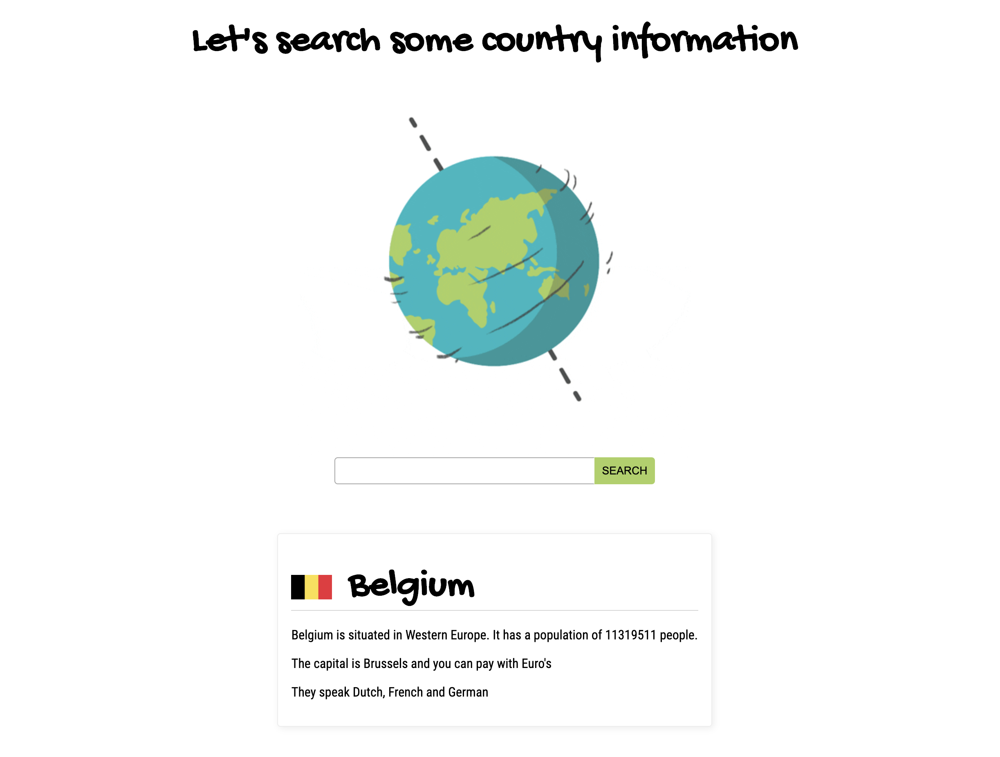

# Opdrachtbeschrijving

## Inleiding




Je gaat dit doen met behulp van de REST Counties API. De documentatie over de verschillende endpoints
kun je [hier](https://restcountries.eu/#api-endpoints-language) vinden. 


## Plan de campagne
- [ ] Goed in de data kijken, waar zit deze info: -> loggen
- [ ] variabele maken, en de currencies uit de data daaraan toekennen
- [ ] functie maken -> formatCurrencies
- [ ] aanroepen -> logje in de functie zetten om te checken
- [ ] input: currencies, parameter(s) toevoegen, argument(en) meegeven
- [ ] parameter loggen om te kijken of de input hebben
- [ ] if
- [ ] 1 currency -> `and you can pay with [currency]'s`
- [ ] 2 currency -> `and you can pay with [currency]'s and [currency]'s`
- [ ] return de waarde `and you can pay with [currency]'s and [currency]'s`
6. _Bonusopdracht:_ Maak een functie die ongeacht het aantal talen die in een land gesproken worden, een string maakt:
    
7. Zorg ervoor dat de opgehaalde data op de volgende manier wordt toegevoegd aan de DOM:
- Waar haal ik de data vandaan? --> Check deze door te loggen.
- Voeg deze data toe aan een variabele.
- functie maken, voeg nodige parameters toe, geef argumenten mee --> Log/check functie.
- for-loop
   * 1 taal: `They speak [language]`
   * 2 talen: `They speak [language] and [language]`
   * 3 talen: `They speak [language], [language] and [language]`
   * etc.


```
[IMAGE: flag]
[country-name]
[country-naam] is situated in [subarea-name]. It has a population of [amount] people.
The capital is [city] and you can pay with [currency]'s
They speak [language], [language] and [language]
```

8. Maak een inputveld op de pagina en zorg ervoor dat als de gebruiker op enter drukt, de functie wordt 
aangeroepen waarmee de gegevens over `België` worden opgehaald. 

9. Zorg ervoor dat de waarde uit het input veld wordt gebruikt als query voor het GET request. 
Er moet alleen een request gedaan worden als de gebruiker op enter drukt, of op de zoek-knop klikt.
_Tip:_ gebruik een globale variabele.

10. Zorg ervoor dat de waarde van het input veld wordt leeggemaakt na elke zoekopdracht.

11. Zorg ervoor dat er altijd maar één zoekresultaat op de pagina staat.

12. Zorg ervoor dat als er naar een land wordt gezocht dat niet bestaat, er een foutmelding in de DOM wordt gezet.
_Tip:_ als er een ongeldige API call wordt gemaakt, zal de response in het `catch` blok terecht komen.

13. Zorg ervoor dat als je na een ongeldige API call weer een geldige API call maakt, de foutmelding verdwenen is.

14. **Bonusopdracht:** make it look nice! 😍